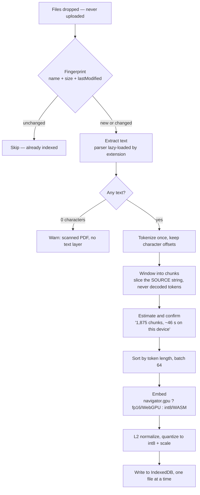

# Architecture — Client-Side Semantic Search

**Status:** v1 built and self-tested (88/88), reranking included. Not yet deployed.

Every decision here is backed by a measurement recorded in
[hypothesis-testing.md](hypothesis-testing.md). The "Evidence" column states what
would have to change for the decision to change. Nothing in this document is a
preference.

**The constraint everything follows from:** documents never leave the browser.
There is no server-side processing. The whole application is a static page.

---

## Decision log

| # | Concern | Decision | Evidence | Ref |
|---|---|---|---|---|
| D1 | Where compute runs | Entirely in the browser; static hosting | Hard privacy constraint — files never leave the device | — |
| D2 | Embedding model | `all-MiniLM-L6-v2`, precision chosen per device | fp16 on WebGPU, int8 on WASM | §7 |
| D3 | int8 on WebGPU | **Excluded outright** | cos 0.0236 vs reference — runs fast, returns noise | §7 |
| D4 | fp16 on the CPU path | Excluded | 2× the download for a statistically identical result | §3 |
| D5 | 4-bit weights | Excluded | Δ −0.0150, p = 0.039 — the only significant degradation measured | §3 |
| D6 | Vector index | Flat typed array, brute-force scan. No ANN library. | ~1 ms for a book-sized corpus; 51 ms at 100k chunks | §2 |
| D7 | Stored vector format | int8 + per-file scale | Δ −0.0007, p = 0.18 — halves the index for no measurable cost | §3 |
| D8 | Chunk text | Sliced from the source string by character offset | Decoding tokens destroys casing and punctuation | §8 |
| D9 | Batching | Length-sorted, batch size 64 | Worth 28.8% of wall clock on many short files, **0.6% on a single book** — free either way | §6, §11 |
| D10 | Tokenizer padding | Explicitly disabled | Shipped `padding: {Fixed:128}` corrupts quantized models | §6 |
| D11 | Chunk size | **200 tokens / 30 overlap**, user-adjustable | Quality indistinguishable (p = 0.33); buys 2.65× less storage for 40% slower indexing | §8, §11 |
| D12 | Persistence | IndexedDB, written per file | Indexing is one-time; must survive reload and resume | — |
| D13 | Threading | Embedding runs in a Web Worker | 99.58% of indexing is the forward pass; it would freeze the UI | §5 |
| D14 | Model delivery | Fetched from the HuggingFace CDN, not self-hosted | Verified to load under COOP/COEP; host then serves only ~100 KB | §8 |
| D15 | Device throughput | Calibrated at runtime, never hardcoded | WASM and WebGPU differ 4.2×; a phone differs again | §7 |
| D16 | Hosting | Render static site | Supports custom response headers; free tier sufficient | §8 |
| D17 | Python CLI | **Deprecated** | Browser app is the product; no dual implementation to keep in sync | — |
| D18 | Static embedding models | Deferred past v1 | Potentially ~1000× faster indexing, but untested and quality-risky | — |
| D19 | Generated answers | **Excluded** | A confident wrong answer is worse than an imperfect passage; results stay verbatim | — |
| D20 | Dev server port | **Fixed at 8768**, fails rather than drifting | IndexedDB is origin-scoped; a different port is a different, empty index | — |
| D21 | Reranking | **Cross-encoder rerank of the top 30, int8, behind a toggle** | +0.064 nDCG (SciFact) and +0.199 (DDIA), both p < 0.001 — the only significant quality lever measured | §9, §10 |
| D22 | Rerank depth | 30 candidates | N=10 significantly too shallow on both corpora; 20–100 indistinguishable, so depth is a latency choice | §9.4, §10.3 |
| D23 | Reranker precision | int8 (23.1 MB), lazily fetched on first search | Keeps the gain (corr 0.9996 with fp32) at a quarter of the download | §9.6 |
| D24 | Book furniture | Contents, index and bibliography **demoted, never deleted** | Citation titles outrank the prose that explains them; score is bimodal, cutoff 25 sits in the gap | — |
| D25 | Result excerpts | Window chosen by distinct query terms covered, snapped to word boundaries | Naive leading excerpts surfaced text that did not contain the answer | — |
| D26 | Result count | User-controlled, 1–10, default 5 | Inputs are dynamic; the right depth is the reader's call, and re-ranking is free from cache | — |
| D27 | File admission | Magic bytes over extension; bidi controls stripped; zip expansion ceiling | Assume hostile input: a 220 KB .docx expanded 456:1 in half a second | — |
| D28 | Bounded work | Per-**step** deadlines (extract 5 min, batch 60 s), 100 files / 500 MB per drop, Stop button | A whole-file timeout punishes long documents, which are legitimately slow | — |
| D29 | Thread count | `min(hardwareConcurrency, 8)` — **flagged, not settled** | Natively throughput peaks at 4 threads and degrades after; needs a browser measurement before changing | §11.6 |

---

## Indexing flow

Three phases. Everything before the worker boundary costs under half a percent
of the total, which is what makes an accurate up-front estimate possible.



| Phase | Where | Share of cost |
|---|---|---|
| 1 — Intake (fingerprint → chunks → estimate) | Main thread | < 0.5% |
| 2 — Embed (sort → batch → forward pass) | Web Worker | 99.58% |
| 3 — Persist | Main thread | 0.01% |

**Step notes**

1. **Fingerprint before reading.** The browser's `File` object exposes `name`,
   `size` and `lastModified`, so unchanged files are skipped without reading a
   byte. This is what makes re-indexing cheap and interrupted runs resumable.
2. **Extract with a lazily-imported parser.** `.txt`/`.md` via `File.text()`,
   free. `.pdf` via pdf.js, `.docx` via fflate plus the `w:t` nodes — both
   imported dynamically, only when that file type first appears. Someone
   searching Markdown never downloads pdf.js.
3. **Guard the empty-text case.** A scanned PDF has no text layer and yields
   zero characters. Say so explicitly rather than indexing nothing and appearing
   broken.
4. **Tokenize exactly once, keeping offsets.** Offsets let boundaries be chosen
   in token space while chunk text is sliced verbatim from the source.
5. **Show the estimate, then commit.** By this point the chunk count is exact,
   and everything so far cost under half a percent. Multiply by the device's
   calibrated rate. This is the only honest moment to ask the user to proceed.
6. **Sort by length, then batch.** Batches pad to their longest member, so
   sorting first is a 23.7% saving for roughly twenty lines of code.
7. **Embed in the worker, persist per file.** Post progress per batch; write
   each file's chunks and vectors as it completes, so stopping at 60% keeps 60%.

---

## Search flow

Roughly five milliseconds end to end for a book-sized corpus — dominated by
embedding the query, not by the scan.


- **The query vector stays fp32.** Only stored vectors are int8. The measured
  −0.0007 penalty quantized *both* sides, so this is strictly better than what
  was tested.
- **Padding is called out on this path because this is where it bites.** Every
  query is short enough to sit under the tokenizer's shipped 128-token pad
  length, so with a quantized model the fault would fire on every single search,
  permanently. Document batches never trigger it; query batches always would.
- No index to rebuild, no ANN structure, no tuning parameters.

---

## Data model

Three IndexedDB stores. Vectors are rebuilt into one contiguous typed array in
memory on load.

```
files      { id, name, size, lastModified, chunkCount, status }
             status: 'indexed' | 'no-text' | 'partial'

chunks     { id, fileId, ordinal, text, charStart, charEnd }
             text is a verbatim slice of the source document

vectors    { fileId, scale, data: Int8Array(chunkCount * 384) }
             one blob per file — written once, read on load

in memory  Int8Array(totalChunks * 384) + Float32Array(scales)
             ~1.9 MB per 600-page book
```

Measured storage ratio: **1,080 bytes per chunk** (chunk text plus int8 vector),
or roughly **1.78 MB per MB of extracted text**.

### The index is bound to an origin

IndexedDB is scoped to scheme + host + **port**, so `127.0.0.1:8768` and
`127.0.0.1:8769` are as unrelated as two different websites. Each keeps its own
`semantic-search` database, and documents indexed on one are invisible from the
other.

This is why `app/serve.py` pins the port and **refuses to start elsewhere**
rather than falling back to the next free one — a drifting port silently hides
every previously indexed document and litters DevTools with orphaned databases.

The same applies in production: moving from localhost to a deployed domain, or
between domains, starts from an empty index. Re-indexing a book takes seconds,
so this is a minor cost today, but see Deferred below.

---

## Hosting

**Render static site.** Free, and its docs confirm support for custom response
headers, which is the binding requirement.

### Required headers

Multi-threaded WASM needs `SharedArrayBuffer`, which requires:

```
Cross-Origin-Opener-Policy: same-origin
Cross-Origin-Embedder-Policy: credentialless
```

Without them the runtime **silently** falls back to single-threaded — several
times slower, with no error raised. The WebGPU path does not need them, so GPU
devices are unaffected either way.

### Host comparison

| Host | Custom headers | Per-file cap | Verdict |
|---|---|---|---|
| **Render** (static) | Yes — dashboard or `render.yaml` | — | **Chosen.** Free, headers confirmed |
| Cloudflare Pages | Yes — `_headers` | 25 MiB | Fine; the cap only bites if self-hosting fp16 (45.3 MB) |
| Netlify | Yes — `_headers` | — | Equivalent |
| GitHub Pages | **No** | — | Avoid — cannot set COOP/COEP, so WASM drops to one thread |

### Model delivery (D14)

Weights are fetched from the HuggingFace CDN rather than served by the host.
Verified under exactly the headers above: the page stayed `crossOriginIsolated`,
the control cosine was identical (0.994287), throughput was unchanged (39.9 vs
40.6 chunks/s), and the local server logged **zero** requests for the weights.
Cold load was 4.6 s versus 0.8 s local, once, then browser-cached.

The host therefore serves ~100 KB of application code. Bandwidth and per-file
caps stop mattering. The trade is a third-party dependency at first load;
self-hosting the 23 MB int8 model is the fallback and fits every host above.

---

## Module layout

```
index.html          drop zone · file list · search · results
worker.js           model load, embed loop, progress messages
src/extract.js      per-type parsers, dynamically imported
src/chunk.js        tokenize once, window, slice by offset
src/store.js        IndexedDB read/write, in-memory matrix
src/search.js       query embed + brute-force scan + top-k
src/calibrate.js    short timed run → this device's chunks/s
_headers            COOP / COEP
```

---

## Capacity

Measured on *Designing Data-Intensive Applications* (613 pages, 23.2 MB PDF):
**6.0% of the file is extractable text**, giving 1,875 chunks and a 1.9 MB index.

| Library | PDF on disk | Text | Chunks | WASM | WebGPU |
|---|---|---|---|---|---|
| 1 book | 23 MB | 1.4 MB | 1.9k | 46 s | 11 s |
| 10 books | 232 MB | 14 MB | 19k | 7.7 min | 1.8 min |
| 50 books | 1.2 GB | 70 MB | 94k | 38 min | 9 min |
| 100 books | 2.3 GB | 140 MB | 188k | 77 min | 18 min |

Two caveats that shape the design:

- **Format flips the ratio.** 6% is a PDF property. Plain `.txt`/`.md` is ~100%
  text, so a notes folder is a heavier corpus per megabyte than a bookshelf.
- **The ratio is not knowable in advance.** A diagram-heavy reference and a dense
  technical text can be the same file size and differ several-fold in cost. This
  is why a file-size cap is not a valid proxy for the real constraint, and why
  the flow extracts and counts *before* committing to embedding (D15, step 5).

---

## Deferred past v1

| Item | Why deferred |
|---|---|
| Static embedding models | Potentially ~1000× faster indexing, but untested and quality-risky. Ship a working v1 first; the eval harness remains available. |
| Chunk-size auto-tuning | Chunk size did not generalize across corpora and is not a large lever. Exposed as a setting instead. |
| Hybrid keyword + semantic search | Not measured. Would help exact-identifier queries that embeddings miss. |
| OCR for scanned PDFs | v1 detects and reports them; it does not read them. |
| Cross-encoder reranking | Reorders retrieved passages using a model that sees query and passage together. Cannot hallucinate — output is a permutation of real passages. Costs ~23 MB and roughly a second per query on WASM, so it needs a measured gain on SciFact before shipping. |
| Index export / import | The index cannot follow the user across origins. Exporting to a file would let a large library survive a domain change or a move off localhost. |
