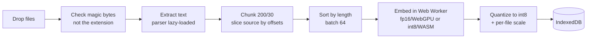
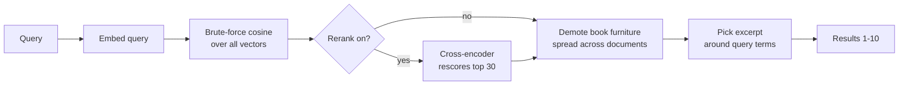

# Overview — what we converged on

The short version of [architecture.md](architecture.md) (full decision log, D1–D29)
and [hypothesis-testing.md](hypothesis-testing.md) (the measurements behind it).

**One constraint drives everything:** documents never leave the browser. No server
processing, no upload. The host serves ~100 KB of static files; model weights come
from the HuggingFace CDN straight to the user's machine.

---

## Indexing — runs once per file

99.6% of the time is step F. Everything before it is under half a percent, which is
why the app can quote an accurate estimate *before* committing to the work.

## Search — runs per query

No ANN index — a flat scan is ~1 ms for a book. Results are always verbatim
document text; nothing is generated.

---

## Config decisions

| Knob | Value | Why |
|---|---|---|
| Embedding model | `all-MiniLM-L6-v2` | 384 dims, small enough to ship to a browser |
| Precision | fp16 on WebGPU, int8 on WASM | WebGPU+int8 returns noise (cos 0.024); never both downloaded |
| Chunk / overlap | **200 / 30** | Quality indistinguishable from alternatives; 2.65× less storage |
| Batch | 64, length-sorted | Saves 28.8% on many short files, ~0% on one book. Free either way |
| Stored vectors | int8 + per-file scale | Halves the index, Δ nDCG −0.0007 (p = 0.18) |
| Storage | IndexedDB, per file | Survives reload; origin-scoped, so the dev port is fixed at 8768 |
| Reranking | Cross-encoder, **top 30**, int8, **toggle** | +0.064 nDCG SciFact, +0.199 DDIA, both p < 0.001 |
| Results shown | 1–10, default 5 | User's call; re-ranks from cache without re-embedding |
| Generated answers | **Excluded** | A confident wrong answer is worse than an imperfect passage |
| Hosting | Render static site | Needs custom COOP/COEP headers for multi-threaded WASM |

## Safety limits

| Limit | Value |
|---|---|
| Per file | 100 MB, 20M chars of text |
| Per drop | 100 files, 500 MB |
| Extracting one document | 5 min |
| Embedding one batch | 60 s |
| Cancellation | Stop button, checked between batches |

Bounds are per **step**, not per file — a whole-file budget would punish long
documents, which are legitimately slow. Files are admitted on magic bytes, filenames
are stripped of bidi characters, and `.docx` archives have a decompression ceiling.

---

## Status

- **Built and self-tested** (88/88): indexing, search, storage, excerpts, furniture
  demotion, limits, timeouts, Stop, and cross-encoder reranking behind a toggle.
- **Not done:** committed to git, deployed to Render, tested on a phone, offline
  behaviour when the CDN is unreachable.
